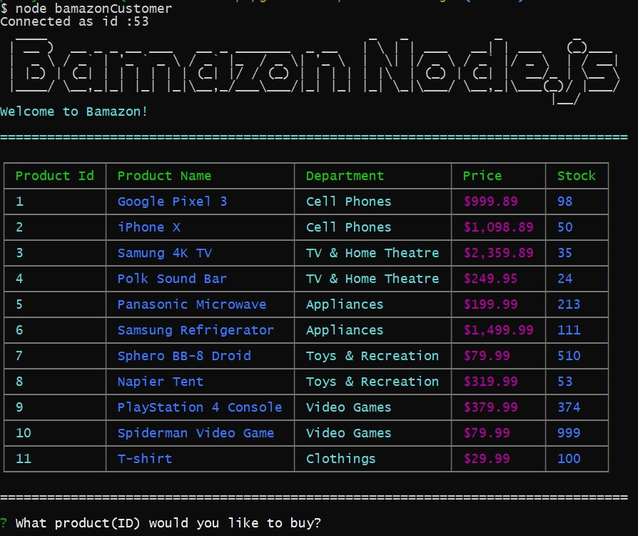
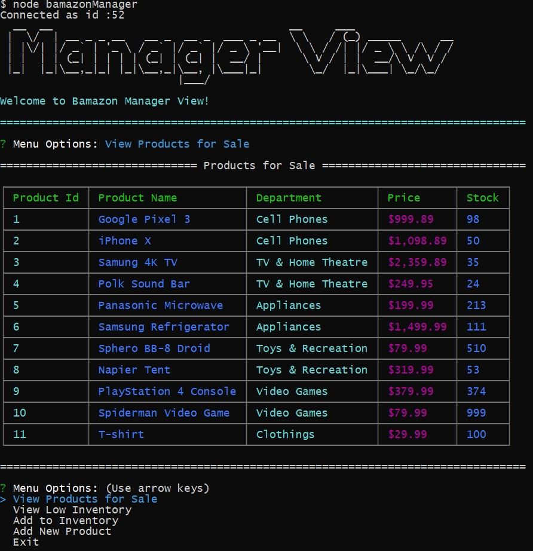

# Bamazon

The goal was to create an Amazon-like storefront by using Node.js and MySQL.

## Getting Started

- Clone repo.
- Run npm install in GitBash for Windows, or Run npm install inTerminal for MAC.
- Use 'Exit' from menu or 'ctrl + c' to exit each mode

### What Each JavaScript Does

1. `BamazonCustomer.js`

    * Prints the products in the store.

    * Prompts customer which product they would like to purchase by item ID.

    * Asks for the quantity.

      * If there is a sufficient amount of the product in stock, it will return the total for that purchase.
      * However, if there is not enough of the product in stock, it will tell the user that there isn't enough of the product.
      * If the purchase goes through, it updates the stock quantity to reflect the purchase.
      * It will also update the product sales in the department table.
	  * If the customer selects `Exit`, it ends the session and doesn't go back to the menu.

-----------------------

2. `BamazonManager.js`

    * Starts with a menu:
        * View Products for Sale
        * View Low Inventory
        * Add to Inventory
        * Add New Product
        * Exit

    * If the manager selects `View Products for Sale`, it lists all of the products in the store including all of their details.

    * If the manager selects `View Low Inventory`, it'll list all the products with less than five items in its StockQuantity column.

    * If the manager selects `Add to Inventory`, it allows the manager to select a product and add inventory.

    * If the manager selects `Add New Product`, it allows the manager to add a new product to the store.

    * If the manager selects `Exit`, it ends the session and doesn't go back to the menu.

-----------------------

3. `BamazonSupervisor.js`

    * Starts with a menu:
        * View Product Sales by Department
        * Create New Department
        * Exit

    * If the manager selects `View Product Sales by Department`, it lists the Department Sales and calculates the total sales from the overhead cost and product sales.

    * If the manager selects `Create New Department`, it allows the manager to create a new department and input current overhead costs and product sales. If there are none, by default it will set at 0.

    * If the manager selects `Exit`, it ends the session and doesn't go back to the menu.

## Demo 

* BamazonCustomer.js 

[***The customer user flow video file***](./assets/video/customer.mp4)

* BamazonManager.js 

[***The Manager user flow video file***](./assets/video/mananger.mp4)

* BamazonSupervisor.js

[***The Supervisor user flow video file***](./assets/video/supervisor.mp4)

## Technologies used
- node.js
- inquire NPM Package (https://www.npmjs.com/package/inquirer)
- mysql NPM Package (https://www.npmjs.com/package/mysql)
- clicolor NPM Package (https://www.npmjs.com/package/clicolor)
- amount NPM Package (https://www.npmjs.com/package/amount)
- figlet NPM Package (https://www.npmjs.com/package/figlet)
- cli-table NPM Package (https://www.npmjs.com/package/cli-table)

### Prerequisites

```
- Node.js - Download the latest version of Node https://nodejs.org/en/
- Create a MYSQL database called 'bamazon', reference bamazon_schema.sql
```


